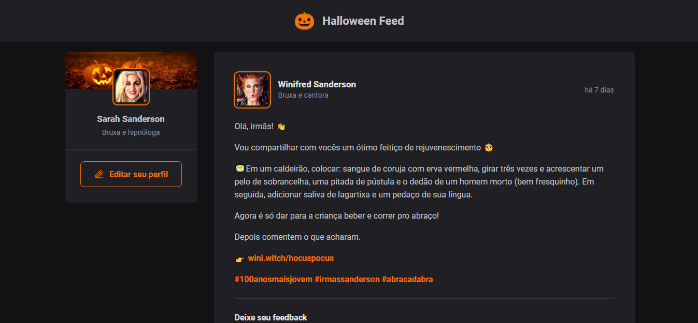

<h1 align="center">
  Halloween Feed 🎃
</h1>

  
  
  
  

 

  

## 💻 Projeto

O Halloween Feed foi um projeto realizado com o objetivo de revisar os conceitos mais importantes do React, como componentização, propriedades, estados, imutabilidade e hooks. Além disso, aplicar o TypeScript para adicionar tipagem estática à aplicação. Ele consiste em um feed de postagens no qual as pessoas podem adicionar ou remover comentários, podendo interagir por meio do botão "Aplaudir".

## ✨ Tecnologias
Essa aplicação foi desenvolvida com as seguintes tecnologias:

- [ReactJS](https://pt-br.reactjs.org/)
- [Typescript](https://www.typescriptlang.org/)
- [CSS Modules](https://vitejs.dev/guide/features.html#css-modules)
- [Phosphor Icons)](https://phosphoricons.com/)
- [Media Queries](https://developer.mozilla.org/pt-BR/docs/Web/CSS/Media_Queries/Using_media_queries)
- [Date-fns](https://date-fns.org/)

## Utilização do projeto

### 💾 Baixar o projeto
Faça o clone do repositório para ter uma versão do projeto em sua máquina: 
`$ git clone https://github.com/mmanaclara/halloween-feed.git`

### 🧰 Instalar dependências
`$ npm install ou yarn`  

### 🚀 Iniciar o projeto
`$ npm run dev ou yarn dev`
 

## 📝 Licença
Este projeto está licenciado nos termos da licença [MIT](https://github.com/mmanaclara/halloween-feed/blob/main/LICENSE). 
